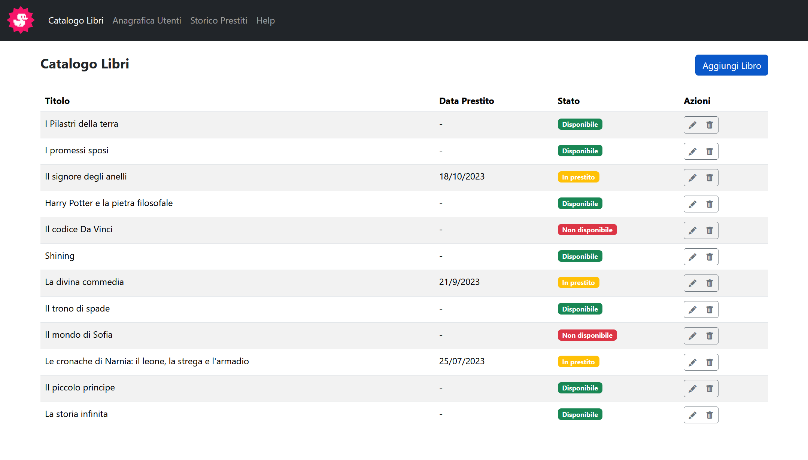
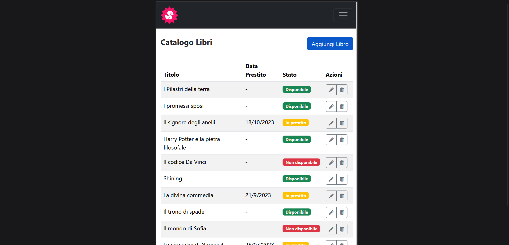
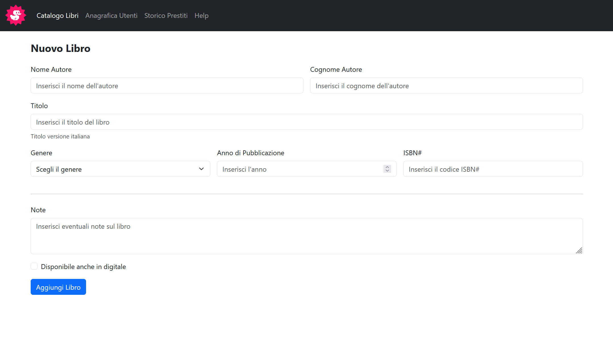
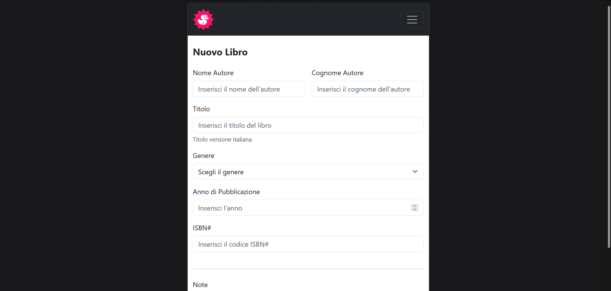

# Bootstrap Dashboard

Esercizio svolto durante il corso Boolean per esercitarmi nella creazione di una dashboard responsive con Bootstrap 5.

L’esercizio è stato sviluppato in due giornate:
1. realizzazione del layout principale della dashboard;
2. aggiunta di una seconda pagina con un form, sempre utilizzando il grid system e i componenti di Bootstrap.

## Obiettivi

- Ricreare il layout di una dashboard (pannello di controllo di un’applicazione web) seguendo gli screenshot forniti.
- Utilizzare la griglia di Bootstrap 5 per ottenere un layout responsive su desktop, tablet e mobile.
- Ridurre al minimo il CSS personalizzato, sfruttando componenti, utility class e helper di Bootstrap.
- Aggiungere una pagina con form strutturato usando:
  - tag HTML per form e campi di input;
  - classi Bootstrap per impaginazione, spaziature e allineamenti.

## Pagine

- **Dashboard**  
  Panoramica con intestazione, barra laterale di navigazione e contenuti principali organizzati in griglia.

- **Pagina form**  
  Form strutturato con Bootstrap (grid system, `row`, `col-*`, `form-control`, ecc.) e campi disposti in modo responsive.

## Anteprima

### Dashboard – Desktop

### Dashboard – Mobile

### Pagina form – Desktop

### Pagina form – Mobile

## Tecnologie utilizzate

- HTML  
- CSS  
- Bootstrap 5
